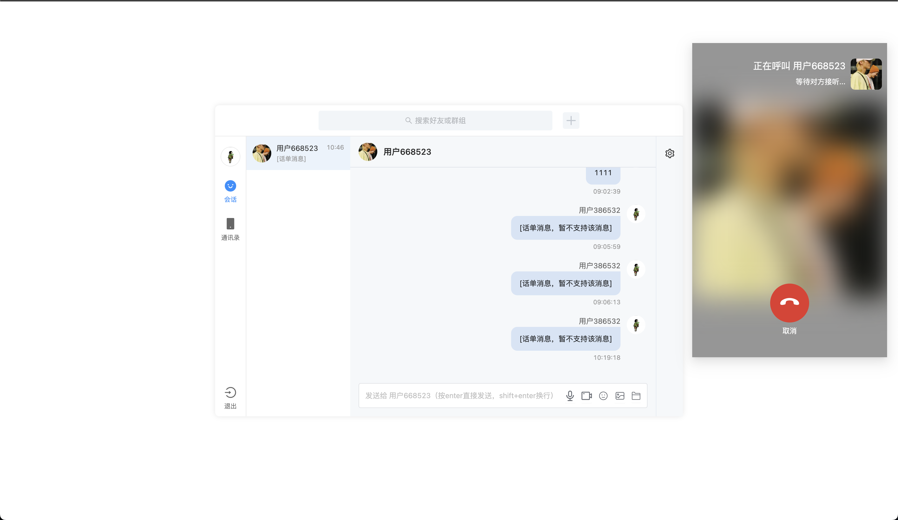
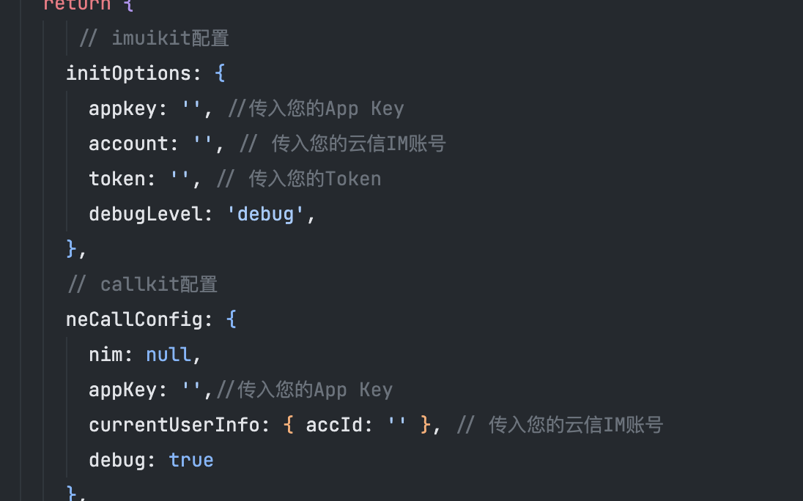

# vue-im-demo
> vue 下 imuikit 跟 callkit demo


## Project setup
```
npm install
```

### Compiles and hot-reloads for development
```
npm run serve
```

### Compiles and minifies for production
```
npm run build
```

### Lints and fixes files
```
npm run lint
```


### 使用
请在 `App.vue` 文件中，相关注释下添加用户自己的配置

### 注意
**请注意 `@xkit-yx/im-kit-ui@0.2.0` 版本，只适用呼叫组件 `@xkit-yx/call-kit-react-ui@0.1.7 @xkit-yx/call-kit@1.6.5` 版本**
<br/>
具体参考 `package.json` 下的版本依赖
